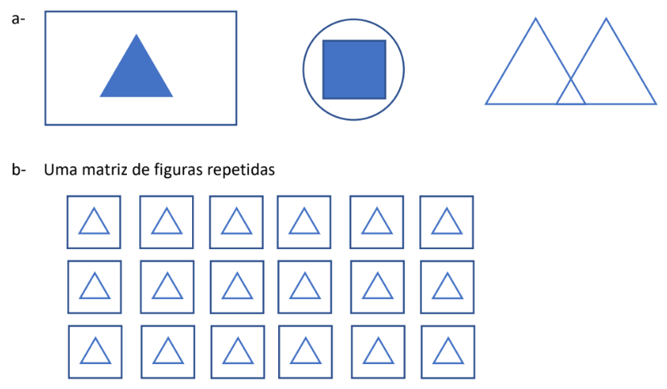

# atividade-canvas-html

1 – Com suas palavras descreva o que é a DOM e qual sua relação com o HTML?

2 – O que é o canvas HTML?

3 – Quais as linguagens e tecnologias comumente envolvidas no desenvolvimento de produtos baseados em
canvas html?

5 – Escreva códigos para renderizar as figuras a seguir:

4 – Explique para que serve o código “document.getElementById()”

6 – Faça um código que, renderize um círculo no meio do canvas, e a posição deste círculo deve ser
controlada pelas setas do teclado.

7 – Modifique o código anterior e substitua círculo renderizado por uma imagem (.png) da sua
escolha.
